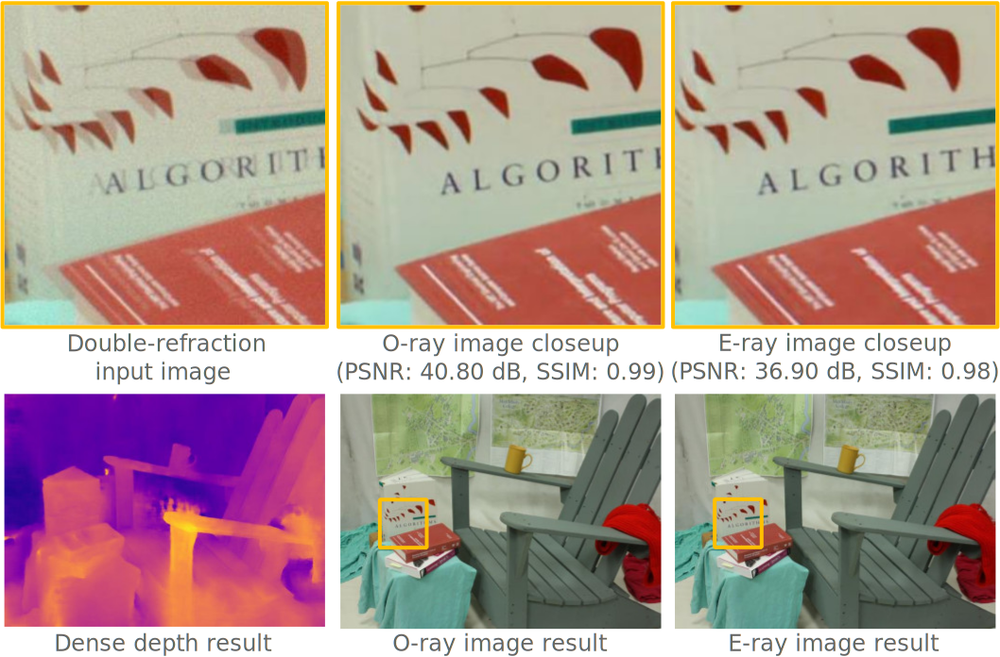

# High-Quality Stereo Image Restoration from Double Refraction

### [Project page](http://vclab.kaist.ac.kr/cvpr2021p2/) | [Paper](http://vclab.kaist.ac.kr/cvpr2021p2/cnn-biref-stereo.pdf) | [Presentation](https://www.youtube.com/watch?v=gO8Ynmu3B8o) | [Dataset](http://vclab.kaist.ac.kr/cvpr2021p2/data.zip)
[Hakyeong Kim](http://vclab.kaist.ac.kr/hkkim/), 
[Andreas Meuleman](https://ameuleman.github.io), 
[Daniel S. Jeon](https://edoli.github.io/research/), 
[Min H. Kim](http://vclab.kaist.ac.kr/minhkim/)<br>
KAIST<br>
Visual Computing Lab., School of Computing

This repository is the implementation of the paper **[High-Quality Stereo Image Restoration from Double Refraction, CVPR 2021](http://vclab.kaist.ac.kr/cvpr2021p2/index.html)**.

</img><br/>


In this work, we present a novel stereo image restoration network that can restore stereo images directly from a double-refraction image.
First, we built a physically faithful birefractive stereo imaging dataset by simulating the double refraction phenomenon with existing RGB-D datasets.
Second, we formulated a joint stereo restoration problem that accounts for not only geometric relation between o-/e-ray images but also joint optimization of restoring both stereo images. We trained our model with our birefractive image dataset in an end-to-end manner.
Our model restores high-quality stereo images directly from double refraction in real-time, enabling high-quality stereo video using a monocular camera.

 
## Installation

We recommend to install dependencies upon conda environment as provided.
Install required dependencies by running below code:   
```
conda env create -f env.yml
conda activate biref
```

## Run demo

For the demo, we provide [synthetic double refraction images dataset](http://vclab.kaist.ac.kr/cvpr2021p2/data.zip) used for evaluation. 
This birefractive dataset has been simulated using [Middlebury 2014 Stereo datasets](https://vision.middlebury.edu/stereo/data/2014/).
Download the data from above link and unzip it in the root directory:
```
wget http://vclab.kaist.ac.kr/cvpr2021p2/data.zip
unzip data.zip
```

To restore stereo images without quantitative evaluation, run:
```
python main.py --cfg="./config.json"
```

The code will restore the stereo images from double refraction images and save results in the output directory.
Printed elapsed time only measures the feed forward operation of the network.

To reproduce the quantitative evaluation (with PSNR and SSIM metric) of restoration network, run with `--eval` flag:
```
python main.py --cfg="./config.json" --eval
```

If there is no available CUDA device, the code will automatically run on CPU. 
However, you can also manually run the model on CPU with `--cpu` flag:
```
python main.py --cfg="./config.json" --cpu
```

## Citation
```
@InProceedings{Kim_2021_CVPR,
   author = {Hakyeong Kim and Andreas Meuleman and Daniel S. Jeon and Min H. Kim},
   title = {High-Quality Stereo Image Restoration from Double Refraction},
   booktitle = {IEEE Conference on Computer Vision and Pattern Recognition (CVPR)},
   month = {June},
   year = {2021}
}       
```
